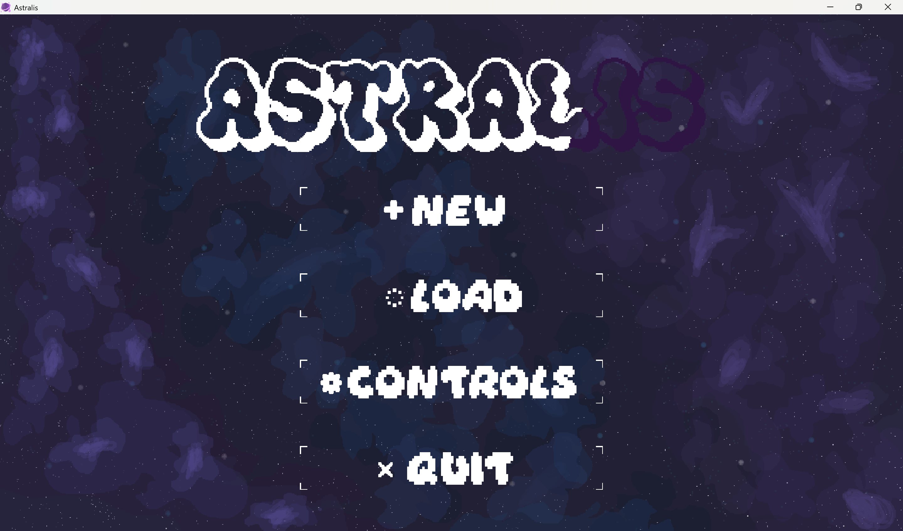
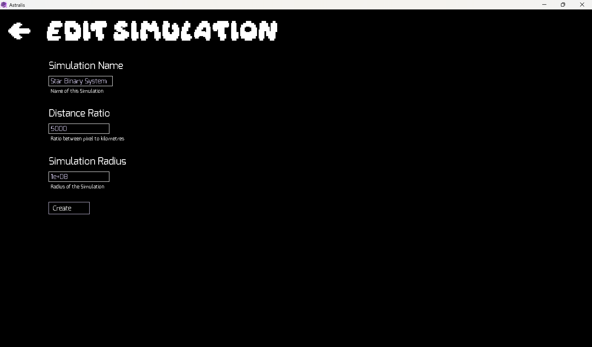
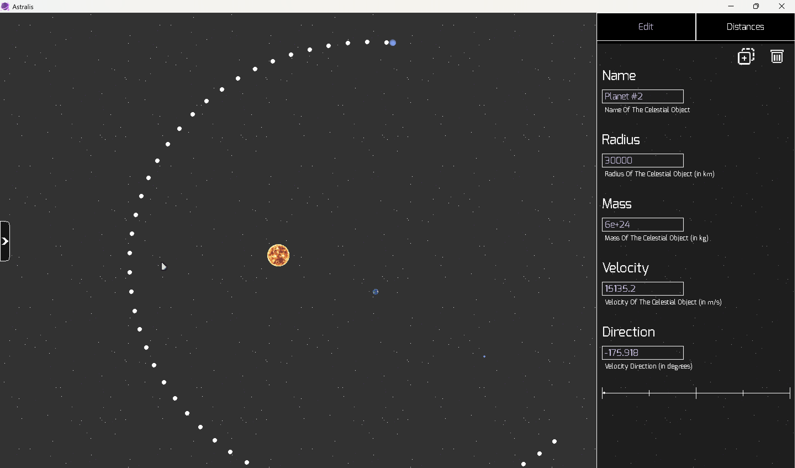
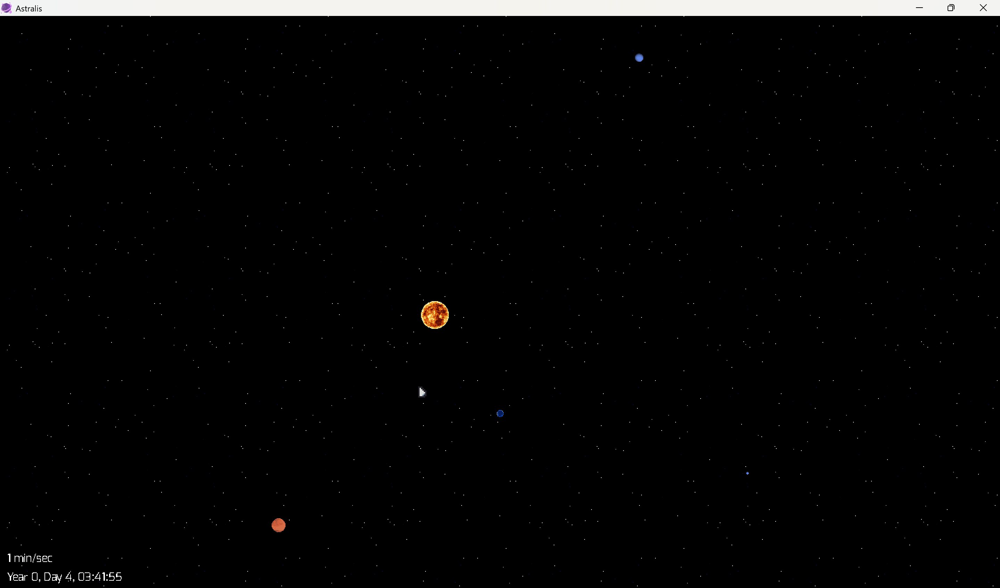
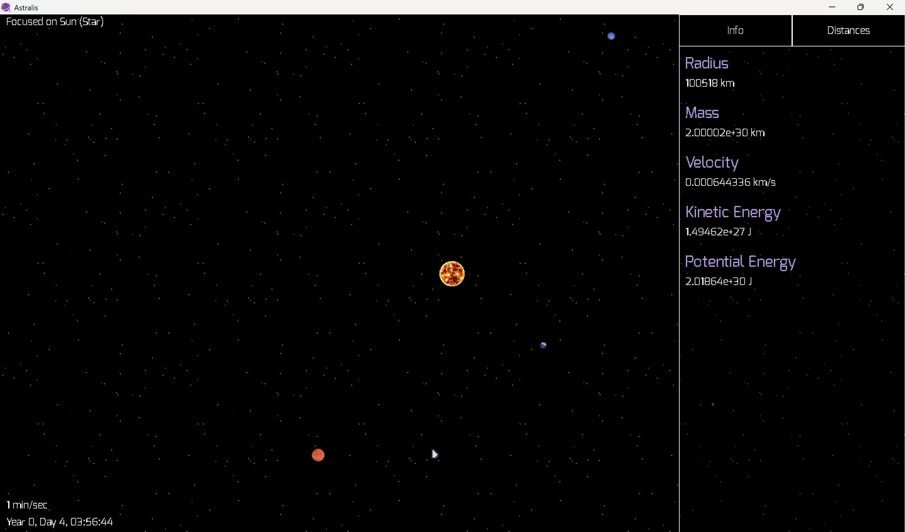

# Astralis

A real time 2D orbital mechanics simulator built with C++ and SDL.  
The project models gravitational systems, collisions, and trajectory behavior with interactive controls and system editing.

## Overview

Astralis simulates celestial bodies under gravitational interaction in a 2D space.  
It focuses on building and experimenting with dynamic systems such as planetary orbits, asteroid fields, and custom scenarios.

## Core Features

- N body gravitational simulation
- Real time trajectory prediction
- Collision detection and response
- Interactive object creation and editing
- Multiple celestial object types
- Particle effects for visual feedback
- Save and load system states using JSON
- SDL based rendering and input system

## Screenshots







## Technical Details

### Physics

- Uses Newtonian gravity
- Force calculated between all bodies based on mass and distance
- Motion integrated over time using a step based update loop
- Supports time scaling for faster or slower simulation
- Collision handling with merging or interaction response

### Rendering

- SDL used for 2D rendering
- Objects drawn with scaling to support large distances
- Trajectories rendered as predicted motion paths
- Particle effects used for visual clarity

### Architecture

- Modular structure separating simulation, rendering, and input
- Event driven system for user interaction
- Simulation loop decoupled from rendering updates
- Asynchronous trajectory calculations for performance

## Requirements

- C++ compatible compiler

## Build

Clone the repository:

```
git clone https://github.com/Mysty-exe/Astralis.git
cd Astralis
```

Build with CMake:

```
mkdir build
cd build
cmake ..
cmake --build . --config Release
```

## Run

Linux or macOS:

```
./Astralis
```

Windows:

```
Astralis.exe
```

## Controls

General

- Space: pause or resume simulation
- Left Arrow / Right Arrow: decrease or increase simulation speed

Camera

- Mouse Drag: pan
- Scroll Wheel: zoom

Editing

- Hold Ctrl: enter editing mode
- Click: create object
- Right Click: modify object
- Delete: remove object

## Project Structure

```
src/       core source files
include/   headers
assets/    textures and visual resources
data/      saved simulation states
build/     generated build files
```

## Future Work

- Improved collision physics
- Higher accuracy integration methods
- Better numerical stability at large scales
- Better UI layer for easier interaction
- More advanced object behaviors

## Notes

- Distances and sizes are scaled for numerical stability
- Performance depends on number of simulated bodies
